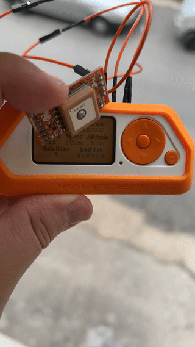

# FlipperZero - L80 GPS module integration

Found a dusty GPS module in the drawer and decided to give it some life:

## Instructions

1. `python3 -m venv .`
2. `source ./venv/bin/activate`
3. `pip3 install -r requirements.txt`
4. [macOS patch] `patch -d venv/lib/python3.12/site-packages/microstacknode/hardware/gps < l80gps.patch`
5. `python3 read_gps.py`

## Schematics (I didn't even try)

## [NMEA] GPS Flipper App

You can also connect your L80 GPS module directly to the Flipper and use the [NMEA GPS app](https://github.com/ezod/flipperzero-gps):

## References

- [L80 Datasheet](https://www.quectel.com/wp-content/uploads/2021/03/Quectel_L80_Hardware_Design_V1.5-1.pdf)
- [Microstack GPS docs](https://www.farnell.com/datasheets/1860443.pdf)
- [Python Microstack docs](https://python3-microstacknode.readthedocs.io/en/latest/example.html)
- [FlipperZero GPIO docs](https://docs.flipper.net/gpio-and-modules)
